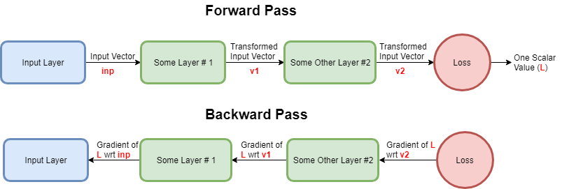

<link
  rel="stylesheet"
  href="https://cdn.jsdelivr.net/npm/katex@0.11.0/dist/katex.min.css"
  integrity="sha384-BdGj8xC2eZkQaxoQ8nSLefg4AV4/AwB3Fj+8SUSo7pnKP6Eoy18liIKTPn9oBYNG"
  crossOrigin="anonymous"
/>

<h3>0. A convnet, you say? In C++?! FROM SCRATCH??!!</h3>
<p style="text-align: justify;">About a week ago, I was at work with absolutely nothing to do - even the office pool table was (is still) broken. If you subscribe to the creationist agenda, you might refer to what happened next as a divine calling. Being a Darwinist myself, I attribute it to mind numbing boredom crippling all rational thought processes. See, over the course of last week, I implemented a machine learning model - one that is notoriously hard to debug when things do not work - in, what perhaps is, the most unforgiving programming language known to man.</p>
<p style="text-align: justify;"><strong>On 18<sup>th</sup> April 2018, I decided to implement a convolutional neural network</strong></p>
<p style="text-align: justify;"><strong>... from scratch</strong></p>
<p style="text-align: justify;"><strong>... in C++</strong></p>
<p style="text-align: justify;">Maybe I thought that it would be a nice way to kill time; maybe I severely (<strong>SEVERELY</strong>) underestimated the magnitude of complexity involved; or maybe .. just maybe, I thought that it might lead to some sort of cosmic enlightenment about the nature of deep learning models (mysterious creatures that they are). As misguided as the foundations of my enterprise may have been, last night my efforts finally came to fruition when <strong>the</strong> <strong>Le Net I implemented scored 0.973 on the <a href="https://www.kaggle.com/c/digit-recognizer">Kaggle Digit Recognizer Challenge</a> leaderboard</strong>. What follows is an account of tears shed in the process.</p>
<p style="text-align: justify;"><strong>The end result can be found <a href="https://github.com/PlantsAndBuildings/cpp-cnn">on my Github</a></strong>. I do plan to add a useful README and instructions for building and running the network soon. In this post, I plan to focus on the aspects I found interesting and challenging about the process - the code on Github contains all the remaining missing parts.</p>
<h3 style="text-align: justify;">1. Which ones do I use?</h3>
<p style="text-align: justify">Right off the bat, I made some decisions about the tools I would use for the implementation:</p>
<p style="text-align: justify">1. I'd already decided that the <strong>implementation would be in C++</strong></p>
<p style="text-align: justify">2. I knew that I needed linear algebra utilities - and I knew of two libraries which could provide that for me: <strong><a href="http://arma.sourceforge.net/">Armadillo</a></strong> and <strong><a href="http://eigen.tuxfamily.org">Eigen</a></strong>. I'd had some experience with both, more with Eigen than Armadillo, but I would have had to install Eigen on my system - and I couldn't be bothered to do that. <strong>Hence, Armadillo.</strong></p>
<p style="text-align: justify">3. I decided (and I still pat myself on the back for this decision) to properly test the code as I was writing it. I decided to use the <strong><a href="https://www.boost.org/doc/libs/1_53_0/libs/test/doc/html/utf.html">Boost Test Framework</a></strong> to write unit tests.</p>
<p style="text-align: justify">A few days into the project I also decided to use the <strong><a href="https://cmake.org/">CMake</a></strong> build system to easily build and run my code.</p>
<h3 style="text-align: justify;">2. Forward and Backward</h3>
<p style="text-align: justify;">I started right in the middle of everything - the convolution layer was the first thing I wanted to do. After a quick constructor implementation, I came to the Forward and Backward passes. The Forward pass was pretty straight-"forward"... See what I did there? <strong>There are several excellent explanations <a href="https://www.youtube.com/watch?v=bNb2fEVKeEo&amp;t=0s&amp;list=PL3FW7Lu3i5JvHM8ljYj-zLfQRF3EO8sYv&amp;index=5">(one can be found here)</a> of the forward pass, and TBH it's not that tough to understand, so I won't go into it here.</strong> I'll just paste my code:</p>

``` c++
void Forward(arma::cube& input, arma::cube& output)
{
  // The filter dimensions and strides must satisfy some contraints for
  // the convolution operation to be well defined.
  assert((inputHeight - filterHeight)%verticalStride == 0);
  assert((inputWidth - filterWidth)%horizontalStride == 0);

  // Output initialization.
  output = arma::zeros((inputHeight - filterHeight)/verticalStride + 1,
                       (inputWidth - filterWidth)/horizontalStride + 1,
                       numFilters);

  // Perform convolution for each filter.
  for (size_t fidx = 0; fidx < numFilters; fidx++)
  {
    for (size_t i=0; i <= inputHeight - filterHeight; i += verticalStride)
      for (size_t j=0; j <= inputWidth - filterWidth; j += horizontalStride)
        output((i/verticalStride), (j/horizontalStride), fidx) = arma::dot(
            arma::vectorise(
                input.subcube(i, j, 0,
                              i+filterHeight-1, j+filterWidth-1, inputDepth-1)
              ),
            arma::vectorise(filters[fidx]));
  }

  // Store the input and output. This will be needed by the backward pass.
  this->input = input;
  this->output = output;
}
```


<p style="text-align: justify;">The backward pass needed some effort. The reason for that requires a slight digression:</p>
<p style="text-align: justify;">See, the issue with most texts on back-propagation (and ultimately most resources on neural networks that I've come across - <strong>with the notable exception of Andrej Karpathy's <a href="http://cs231n.stanford.edu/">CS231n</a></strong>) is that they explain things like gradients flowing backwards only in the context of dense layers. When I first started reading about backprop, I had this notion that it was a specialized mathematical technique developed by neural network scientists (?) to be applied only in the context of training neural networks - and that too fully connected feedforward networks. It is not that tough to grasp backpropagation in this context because all operations are dot products and sigmoid/softmax activations - and we all can calculate derivatives of these functions using high-school calculus. Then you find out about convnets and now you have this scary new operation called a convolution which involves a filter and sliding across an input - and it is certainly not intuitive how a gradient can be calculated. By the time one gets to reading about RNNs and LSTMs, they've given up all hope on trying to understand how the backward pass works. This ignorance is enabled, nay, encouraged by prebuilt, packaged, served-on-a-silver-platter layers the kind of which are provided by Keras, Caffe and jack-in-the-box deep learning framework.</p>
<p style="text-align: justify;">The real trick to figuring out the backward pass through a convolution layer is that there is no trick. You just have to roll up your sleeves, clench your jaw, muster up all your grit and write it out on a piece of paper - atleast that's how I did it (perhaps to a less dramatic narration). <strong>Deriving backpropagation equations for any layer on your own, without looking up anything on the Internet is (atleast in my experience) a very fulfilling experience. It opened my eyes to how general the method is - that it can be applied in any context (not just neural nets) where gradients of highly composite functions are needed.</strong></p>
<p style="text-align: justify;">Coming back to the Backward pass through a conv layer. <strong>Here is how I derived it</strong>:</p>
Consider first, the case of a linear input with linear filters. Suppose the input size is 8 which is being convolved with a filter of size 3.

$$ \begin{bmatrix}x_1\\x_2\\x_3\\x_4\\x_5\\x_6\\x_7\\x_8\end{bmatrix} * \begin{bmatrix}f_1\\f_2\\f_3\end{bmatrix} = \begin{bmatrix} f_1 x_1 + f_2 x_2 + f_3 x_3\\f_1 x_2 + f_2 x_3 + f_3 x_4\\ f_1 x_3 + f_2 x_4 + f_3 x_5\\ f_1 x_4+ f_2 x_5+ f_3 x_6\\ f_1 x_5+ f_2 x_6+ f_3 x_7\\ f_1 x_6+ f_2 x_7+ f_3 x_8 \end{bmatrix} = \begin{bmatrix}y_1\\y_2\\y_3\\y_4\\y_5\\y_6\end{bmatrix} $$

Now, we see that the loss $ L $ is a function of $ y_1, y_2, y_3, y_4, y_5 $ and $ y_6 $

$$ L = L(y_1, y_2, y_3, y_4, y_5, y_6) $$

In the backpropagation step, we <strong>use the gradient of loss with respect to the layer outputs to compute the gradients of the loss with respect to the layer inputs</strong>. It should be clear why the gradient of loss with respect to the output is already available. Hence, when the backward pass reaches the convolution layer, we already have $ \nabla_y L $. Two minor notes:

1. Just a refresher, $ \nabla_y L = \begin{bmatrix} \frac{\partial L}{\partial y_1}\\ \frac{\partial L}{\partial y_2}\\ \frac{\partial L}{\partial y_3}\\ \frac{\partial L}{\partial y_4}\\ \frac{\partial L}{\partial y_5}\\ \frac{\partial L}{\partial y_6}\\ \end{bmatrix}$

2. Also, if it is not clear why this is already available when the backward pass reaches the convolution layer - consider this hastily made flowchart of forward and backward passes:


So, to leverage the math notation and state things concisely: <strong>we are given</strong> $ \nabla_y L $ <strong>and we must compute</strong> $ \nabla_x L $<strong> and</strong> $ \nabla_f L $<strong>.</strong> That doesn't seem too hard, does it? We can almost directly write out:

$$ \nabla_x L = \begin{bmatrix} \frac{\partial L}{\partial x_1}\\ \frac{\partial L}{\partial x_2}\\ \frac{\partial L}{\partial x_3}\\ \frac{\partial L}{\partial x_4}\\ \frac{\partial L}{\partial x_5}\\ \frac{\partial L}{\partial x_6}\\ \frac{\partial L}{\partial x_7}\\ \frac{\partial L}{\partial x_8} \end{bmatrix} $$

$$ \nabla_x L = \begin{bmatrix} \frac{\partial L}{\partial y_1}\frac{\partial y_1}{\partial x_1} + \frac{\partial L}{\partial y_2}\frac{\partial y_2}{\partial x_1} + \frac{\partial L}{\partial y_3}\frac{\partial y_3}{\partial x_1} + \frac{\partial L}{\partial y_4}\frac{\partial y_4}{\partial x_1} + \frac{\partial L}{\partial y_5}\frac{\partial y_5}{\partial x_1} + \frac{\partial L}{\partial y_6}\frac{\partial y_6}{\partial x_1}\\ \frac{\partial L}{\partial y_1}\frac{\partial y_1}{\partial x_2} + \frac{\partial L}{\partial y_2}\frac{\partial y_2}{\partial x_2} + \frac{\partial L}{\partial y_3}\frac{\partial y_3}{\partial x_2} + \frac{\partial L}{\partial y_4}\frac{\partial y_4}{\partial x_2} + \frac{\partial L}{\partial y_5}\frac{\partial y_5}{\partial x_2} + \frac{\partial L}{\partial y_6}\frac{\partial y_6}{\partial x_2}\\ . \\ . \\ . \\  \frac{\partial L}{\partial y_1}\frac{\partial y_1}{\partial x_8} + \frac{\partial L}{\partial y_2}\frac{\partial y_2}{\partial x_8} + \frac{\partial L}{\partial y_3}\frac{\partial y_3}{\partial x_8} + \frac{\partial L}{\partial y_4}\frac{\partial y_4}{\partial x_8} + \frac{\partial L}{\partial y_5}\frac{\partial y_5}{\partial x_8} + \frac{\partial L}{\partial y_6}\frac{\partial y_6}{\partial x_8} \end{bmatrix}$$

And similarly,

$$ \nabla_f L = \begin{bmatrix} \frac{\partial L}{\partial f_1}\\ \frac{\partial L}{\partial f_2}\\ \frac{\partial L}{\partial f_3} \end{bmatrix} $$

$$ \nabla_f L = \begin{bmatrix} \frac{\partial L}{\partial y_1}\frac{\partial y_1}{\partial f_1} + \frac{\partial L}{\partial y_2}\frac{\partial y_2}{\partial f_1} + \frac{\partial L}{\partial y_3}\frac{\partial y_3}{\partial f_1} + \frac{\partial L}{\partial y_4}\frac{\partial y_4}{\partial f_1} + \frac{\partial L}{\partial y_5}\frac{\partial y_5}{\partial f_1} + \frac{\partial L}{\partial y_6}\frac{\partial y_6}{\partial f_1}\\ \frac{\partial L}{\partial y_1}\frac{\partial y_1}{\partial f_2} + \frac{\partial L}{\partial y_2}\frac{\partial y_2}{\partial f_2} + \frac{\partial L}{\partial y_3}\frac{\partial y_3}{\partial f_2} + \frac{\partial L}{\partial y_4}\frac{\partial y_4}{\partial f_2} + \frac{\partial L}{\partial y_5}\frac{\partial y_5}{\partial f_2} + \frac{\partial L}{\partial y_6}\frac{\partial y_6}{\partial f_2}\\ \frac{\partial L}{\partial y_1}\frac{\partial y_1}{\partial f_3} + \frac{\partial L}{\partial y_2}\frac{\partial y_2}{\partial f_3} + \frac{\partial L}{\partial y_3}\frac{\partial y_3}{\partial f_3} + \frac{\partial L}{\partial y_4}\frac{\partial y_4}{\partial f_3} + \frac{\partial L}{\partial y_5}\frac{\partial y_5}{\partial f_3} + \frac{\partial L}{\partial y_6}\frac{\partial y_6}{\partial f_3} \end{bmatrix} $$


The gradient with respect to $ x $ can be rewritten as:


$$ \nabla_x L = \begin{bmatrix} \frac{\partial L}{\partial y_1} f_1 + 0 + 0 + 0 + 0 + 0\\ \frac{\partial L}{\partial y_1} f_2 + \frac{\partial L}{\partial y_2} f_1 + 0 + 0 + 0 + 0\\ \frac{\partial L}{\partial y_1} f_3 + \frac{\partial L}{\partial y_2} f_2 + \frac{\partial L}{\partial y_3} f_1 + 0 + 0 + 0\\ 0 + \frac{\partial L}{\partial y_2} f_3 + \frac{\partial L}{\partial y_3} f_2 + \frac{\partial L}{\partial y_4} f_1 + 0 + 0\\ 0 + 0 + \frac{\partial L}{\partial y_3} f_3 + \frac{\partial L}{\partial y_4} f_2 + \frac{\partial L}{\partial y_5} f_1 + 0\\ 0 + 0 + 0 + \frac{\partial L}{\partial y_4} f_3 + \frac{\partial L}{\partial y_5} f_2 + \frac{\partial L}{\partial y_6} f_1\\ 0 + 0 + 0 + 0 + \frac{\partial L}{\partial y_5} f_3 + \frac{\partial L}{\partial y_6} f_2\\ 0 + 0 + 0 + 0 + 0 + \frac{\partial L}{\partial y_6} f_3 \end{bmatrix}$$

And further as:

$$ \nabla_x L = \frac{\partial L}{\partial y_1}\begin{bmatrix} f_1\\f_2\\f_3\\0\\0\\0\\0\\0 \end{bmatrix} + \frac{\partial L}{\partial y_2}\begin{bmatrix} 0\\f_1\\f_2\\f_3\\0\\0\\0\\0 \end{bmatrix} + \frac{\partial L}{\partial y_3}\begin{bmatrix} 0\\0\\f_1\\f_2\\f_3\\0\\0\\0 \end{bmatrix} + \frac{\partial L}{\partial y_4}\begin{bmatrix} 0\\0\\0\\f_1\\f_2\\f_3\\0\\0 \end{bmatrix} + \frac{\partial L}{\partial y_5}\begin{bmatrix} 0\\0\\0\\0\\f_1\\f_2\\f_3\\0 \end{bmatrix} + \frac{\partial L}{\partial y_6}\begin{bmatrix} 0\\0\\0\\0\\0\\f_1\\f_2\\f_3 \end{bmatrix}$$

Pretty neat, huh?

As you might expect, the gradient with respect to the filter is also works out to a nice expression:

$$ \nabla_f L = \begin{bmatrix}\frac{\partial L}{\partial y_1}x_1 + \frac{\partial L}{\partial y_2}x_2 + \frac{\partial L}{\partial y_3}x_3 + \frac{\partial L}{\partial y_4}x_4 + \frac{\partial L}{\partial y_5}x_5 + \frac{\partial L}{\partial y_6}x_6\\ \frac{\partial L}{\partial y_1}x_2 + \frac{\partial L}{\partial y_2}x_3 + \frac{\partial L}{\partial y_3}x_4 + \frac{\partial L}{\partial y_4}x_5 + \frac{\partial L}{\partial y_5}x_6 + \frac{\partial L}{\partial y_6}x_7\\ \frac{\partial L}{\partial y_1}x_3 + \frac{\partial L}{\partial y_2}x_4 + \frac{\partial L}{\partial y_3}x_5 + \frac{\partial L}{\partial y_4}x_6 + \frac{\partial L}{\partial y_5}x_7 + \frac{\partial L}{\partial y_6}x_8 \end{bmatrix} $$

$$ \nabla_f L = \frac{\partial L}{\partial y_1} \begin{bmatrix} x_1\\x_2\\x_3 \end{bmatrix} + \frac{\partial L}{\partial y_2} \begin{bmatrix} x_2\\x_3\\x_4 \end{bmatrix} + \frac{\partial L}{\partial y_3} \begin{bmatrix} x_3\\x_4\\x_5 \end{bmatrix} + \frac{\partial L}{\partial y_4} \begin{bmatrix} x_4\\x_5\\x_6 \end{bmatrix} + \frac{\partial L}{\partial y_5} \begin{bmatrix} x_5\\x_6\\x_7 \end{bmatrix} + \frac{\partial L}{\partial y_6} \begin{bmatrix} x_6\\x_7\\x_8 \end{bmatrix}  $$

**Here is the intuition behind these results:**

**Consider the gradients with respect to the filters (** $ \nabla_f L $ **) -** **we know that at a particular position over the input, the filters only "affect" one activation value. Ie. when the filters are over** $ x_{1:3} $**, then they only "affect" the first output activation** $ y_1 $**; when the filters are over** $ x_{2:4} $**, then they only "affect" the second output activation** $ y_2 $ **- and so on. Each of the output activations, in turn, "affects" the loss to various degrees - which is given by the gradient of loss with respect to the output activations (Ie.** $ \nabla_y L $**). Thus, the net "affect" a filter has on the loss should be of the form:**

$$ \nabla_f L = \sum_{i = 1}^{6}{(\text{affect of filter on } y_i) (\text{affect } y_i\text{ has on } L)}$$

**Now, the affect that the filter has on** $ y_i $ **is given by** $ \nabla_{f} y_i $** - which is simply** $ \begin{bmatrix} x_i\\x_{i+1}\\x_{i+2} \end{bmatrix} $ **- and the affect** $ y_i $ **has on** $ L $ **is given by** $ \frac{\partial L}{\partial y_i} $**. Thus we see that, our intuition also yields**:

$$ \nabla_f L = \frac{\partial L}{\partial y_1} \begin{bmatrix} x_1\\x_2\\x_3 \end{bmatrix} + \frac{\partial L}{\partial y_2} \begin{bmatrix} x_2\\x_3\\x_4 \end{bmatrix} + \frac{\partial L}{\partial y_3} \begin{bmatrix} x_3\\x_4\\x_5 \end{bmatrix} + \frac{\partial L}{\partial y_4} \begin{bmatrix} x_4\\x_5\\x_6 \end{bmatrix} + \frac{\partial L}{\partial y_5} \begin{bmatrix} x_5\\x_6\\x_7 \end{bmatrix} + \frac{\partial L}{\partial y_6} \begin{bmatrix} x_6\\x_7\\x_8 \end{bmatrix} $$

If you think about it long enough, you will find that the <strong>same exact intuition works for the gradient with respect to the input as well</strong>. Here is a hint:

$$ \nabla_x L = \sum_{i = 1}^{6}{(\text{affect of input values on the activation } y_i)(\text{affect } y_i \text{ has on } L)}$$

Okay, with that verbose explanation in place, I present my <strong>convolution layer backward pass</strong>:

``` c++

void Backward(arma::cube& upstreamGradient)
{
  // Upstream gradient must have same dimensions as the output.
  assert(upstreamGradient.n_slices == numFilters);
  assert(upstreamGradient.n_rows == output.n_rows);
  assert(upstreamGradient.n_cols == output.n_cols);

  // Initialize gradient wrt input. Note that the dimensions are same as those
  // of the input.
  gradInput = arma::zeros(arma::size(input));

  // Compute the gradient wrt input.
  for (size_t sidx=0; sidx < numFilters; sidx++)
  {
    for (size_t r=0; r<output.n_rows; r ++)
    {
      for (size_t c=0; c<output.n_cols; c ++)
      {
        arma::cube tmp(arma::size(input), arma::fill::zeros);
        tmp.subcube(r*verticalStride,
                    c*horizontalStride,
                    0,
                    (r*verticalStride)+filterHeight-1,
                    (c*horizontalStride)+filterWidth-1,
                    inputDepth-1)
            = filters[sidx];
        gradInput += upstreamGradient.slice(sidx)(r, c) * tmp;
      }
    }
  }

  // Update the accumulated gradient wrt input.
  accumulatedGradInput += gradInput;

  // Initialize the gradient wrt filters.
  gradFilters.clear();
  gradFilters.resize(numFilters);
  for (size_t i=0; i<numFilters; i++)
    gradFilters[i] = arma::zeros(filterHeight, filterWidth, inputDepth);

  // Compute the gradient wrt filters.
  for (size_t fidx=0; fidx<numFilters; fidx++)
  {
    for (size_t r=0; r<output.n_rows; r ++)
    {
      for (size_t c=0; c<output.n_cols; c ++)
      {
        arma::cube tmp(arma::size(filters[fidx]), arma::fill::zeros);
        tmp = input.subcube(r*verticalStride,
                            c*horizontalStride,
                            0,
                            (r*verticalStride)+filterHeight-1,
                            (c*horizontalStride)+filterWidth-1,
                            inputDepth-1);
        gradFilters[fidx] += upstreamGradient.slice(fidx)(r, c) * tmp;
      }
    }
  }

  // Update the accumulated gradient wrt filters.
  for (size_t fidx=0; fidx<numFilters; fidx++)
    accumulatedGradFilters[fidx] += gradFilters[fidx];
}

```
<h3>3. A Note on Gradient Checking</h3>
<p style="text-align: justify;">With the convolution layer implementation out of the way, the remaining layers were relatively easy to implement. Maybe the max-pooling layer was a bit tricky - like the convolution layer, it also has the deceptive sliding-window operation. However, with the understanding gleaned from the convolution layer backward pass implementation - this did not pose too much of a hurdle. As I had decided at the very beginning of the project, I was going to test every single layer immediately after I'd written it. Although I didn't write unit tests very extensively, I did write enough of them to make sure that the layers worked correctly for my purposes (Ie. that of solving the digit recognizer challenge).</p>
<p style="text-align: justify;">The forward pass through any layer is easily checked. First, we manually compute the forward pass through a layer for some hand-crafted input, and then compare it with the output we get from the layer's forward pass code. Checking the backward pass is not that straightforward. The output of a backward pass through a layer is the gradient of loss with respect to the layer inputs. One commonly used technique is called <strong>gradient checking.</strong> See, the backward pass code essentially contains the formula for the analytic gradient. <strong>In a gradient check, we simply compare the gradient computed by the analytic formula and one computed by making small changes in the input (finite difference method). If the two agree to a certain tolerance limit, then we can be fairly sure that our implementation is correct.</strong> I'd used gradient check to check my convolution layer implementation - and for other layers as well.</p>
<p style="text-align: justify;">Here is an example of gradient checking from a test I wrote for the convolution layer backward pass:</p>

``` c++

BOOST_AUTO_TEST_CASE(BackwardPassBigTest)
{
  // Input is 7 rows, 11 cols, and 3 slices.
  arma::cube input(7, 11, 3, arma::fill::randn);

  ConvolutionLayer c(
      7,  // Input height.
      11,  // Input width.
      3,  // Input depth.
      3,  // Filter height.
      5,  // Filter width.
      2,  // Horizontal stride.
      2,  // Vertical stride.
      2); // Number of filters.

  arma::cube output;
  c.Forward(input, output);

  // For now, let the loss be the sum of all the output activations. Therefore,
  // the upstream gradient is all ones.
  arma::cube upstreamGradient(3, 4, 2, arma::fill::ones);

  c.Backward(upstreamGradient);

  arma::cube gradInput = c.getGradientWrtInput();

  std::vector<arma::cube> gradFilters = c.getGradientWrtFilters();

  // Now compute approximate gradients.
  double disturbance = 0.5e-5;

  output = arma::zeros(arma::size(output));
  arma::cube approxGradientWrtInput(arma::size(input), arma::fill::zeros);
  for (size_t i=0; i<input.n_elem; i++)
  {
    input[i] += disturbance;
    c.Forward(input, output);
    double l1 = arma::accu(output);
    input[i] -= 2*disturbance;
    c.Forward(input, output);
    double l2 = arma::accu(output);
    approxGradientWrtInput[i] = (l1 - l2)/(2.0*disturbance);
    input[i] += disturbance;
  }

  BOOST_REQUIRE(arma::approx_equal(gradInput,
                                   approxGradientWrtInput,
                                   "absdiff",
                                   disturbance));

  std::vector<arma::cube> approxGradientWrtFilters(2);
  approxGradientWrtFilters[0] = arma::zeros(3, 5, 3);
  approxGradientWrtFilters[1] = arma::zeros(3, 5, 3);

  std::vector<arma::cube> filters = c.getFilters();

  for (size_t fidx=0; fidx<2; fidx++)
  {
    for (size_t idx=0; idx<filters[fidx].n_elem; idx++)
    {
      filters[fidx][idx] += disturbance;
      c.setFilters(filters);
      c.Forward(input, output);
      double l1 = arma::accu(output);
      filters[fidx][idx] -= 2.0*disturbance;
      c.setFilters(filters);
      c.Forward(input, output);
      double l2 = arma::accu(output);
      approxGradientWrtFilters[fidx][idx] = (l1-l2)/(2.0*disturbance);
      filters[fidx][idx] += disturbance;
      c.setFilters(filters);
    }
  }

  for (size_t fidx=0; fidx<2; fidx++)
    BOOST_REQUIRE(arma::approx_equal(gradFilters[fidx],
                  approxGradientWrtFilters[fidx],
                  "absdiff",
                  disturbance));
}

```
<h3 style="text-align: justify;">4. Le Net</h3>
<p style="text-align: justify;">What I realized - as I started assembling the pieces I'd written - was that while small modules may each work perfectly when they're isolated, they can raise a shit-storm when put together. For the longest time after I'd put together my Le Net, I was befuddled at why the network was deciding to output equal probabilities for all categories. I'd checked and rechecked the outputs of all the layers -- and everything was working as it should have in isolation, but put together, the network was completely useless. But I'm getting ahead of myself, let's start at the beginning:</p>
<p style="text-align: justify;">Six days into working on the groundup implementation, I had implemented and tested all my layers - and was quite happy with my progress. I'd even written a small integration test where I trained a network on a synthetic dataset. Everything was good. I decided to make things prettier before I started on LeNet, so I made a bunch of style fixes, refactored everything and even wrote a CMake configuration. I also wrote a utility module for reading the challenge data into Armadillo data structures.</p>
<p style="text-align: justify;">I wrote the Le Net implementation and tested it on a very small dataset. It seemed to work in one go, and so I thought that since everything is working fine, and since Le Net is such a popular neural network architecture, I might as well go ahead and train it on the entire challenge data. <strong>In retrospect, I made the following critical errors:</strong></p>


<ol style="text-align: justify;">
<li><strong>I was always only looking at the loss values after each epoch.</strong></li>
<li><strong>I jumped on to full dataset training too soon.</strong></li>
</ol>

The first error was perhaps the one that wasted more of my time. See, I was looking at only the loss values when in fact **the metric that I really wanted to optimize for was accuracy.** **Classification error rate is not a smooth function, and hence we use a surrogate loss, right? But, we don't really care about the decrease in surrogate loss. We care about the decrease in classification error!!** What happened to me was that the  cross entropy loss always decreased to 2.3 and stopped. I thought that - oh well, this is what the network is converging to and it must be correct. Later on, when I looked closely at the predictions my network was making, I found that this loss corresponds to all output probabilities being the same:

$$ -10 \log(0.1) \approx 2.3 $$

<h3 style="text-align: justify;">5. Le Net ... again</h3>


<p style="text-align: justify;">Eight days into the groundup implementation, I'd started to lose my shit. My Le Net would just not work. No matter what I did, the accuracy would not budge. I soon reached a stage where I'd fucked things up so much that all metrics showed a decreasing trend - even the accuracies! I had already painstakingly checked all outputs of each layer by hand. Everything looked correct except for one thing: the outputs of the dense layer were of the order of $ 10^2 $. Clearly this was too high for softmax to give meaningful output - what I mean by that is that the softmax output was very close to a one-hot vector. This was causing numerical instability issues in the subsequent cross entropy loss layer (NaNs and infs popping up everywhere). However, scaling the dense layer output also did not help much - the network was still showing equal probabilities for all output classes.</p>
<p style="text-align: justify;">A good two days were wasted on trying to fix the Le Net - to no avail. In exasperation, I decided to reset the project to a checkpoint where things looked better. I wiped my working directory of all Le Net changes and resolved to give it one - just one - more try. If it still did not work, I would delete the project and never think of it as long as I live. I then wrote the <strong>three integration tests that saved this project</strong> from digital abyss:</p>
<ol style="text-align: justify;">
<li><strong>I wrote a simple Multi-Layer Perceptron that learned the AND decision boundary.</strong> This test pointed out two errors in my dense layer implementations. First, that I'd forgotten to incorporate the upstream gradient into the weight update for the dense layer weights. Second, that I'd forgotten to add the biases. I was quick to correct these defects.</li>
<li><strong>Next, I wrote a test to train a simple network to correctly recognize just one handwritten digit.</strong> The network included all components of a Le Net - and had a (conv - ReLU - max pool - dense - softmax - cross entropy) schema.</li>
<li><strong>Finally, I trained the above network on the medium sized dataset I'd sampled from the complete data.</strong></li>
</ol>
<p style="text-align: justify;"> The results of the third test (presented below) gave me some hope:</p>

```
 [DEBUG INTEGRATION TEST ]   Size of training set: 2700
 [DEBUG INTEGRATION TEST ]   Size of validation set: 300
 [DEBUG INTEGRATION TEST ]
 [DEBUG INTEGRATION TEST ]   Average loss: 2.22893
 [DEBUG INTEGRATION TEST ]   Validation Accuracy: 0.406667
 [DEBUG INTEGRATION TEST ]
 [DEBUG INTEGRATION TEST ]   Average loss: 1.33203
 [DEBUG INTEGRATION TEST ]   Validation Accuracy: 0.676667
 [DEBUG INTEGRATION TEST ]
 [DEBUG INTEGRATION TEST ]   Average loss: 0.841367
 [DEBUG INTEGRATION TEST ]   Validation Accuracy: 0.753333
 [DEBUG INTEGRATION TEST ]
 [DEBUG INTEGRATION TEST ]   Average loss: 0.584995
 [DEBUG INTEGRATION TEST ]   Validation Accuracy: 0.79
 [DEBUG INTEGRATION TEST ]
 [DEBUG INTEGRATION TEST ]   Average loss: 0.44068
 [DEBUG INTEGRATION TEST ]   Validation Accuracy: 0.813333
 [DEBUG INTEGRATION TEST ]
 [DEBUG INTEGRATION TEST ]   Average loss: 0.360519
 [DEBUG INTEGRATION TEST ]   Validation Accuracy: 0.81
 [DEBUG INTEGRATION TEST ]
 [DEBUG INTEGRATION TEST ]   Average loss: 0.294253
 [DEBUG INTEGRATION TEST ]   Validation Accuracy: 0.84
 [DEBUG INTEGRATION TEST ]
 [DEBUG INTEGRATION TEST ]   Average loss: 0.265645
 [DEBUG INTEGRATION TEST ]   Validation Accuracy: 0.83
 [DEBUG INTEGRATION TEST ]
 [DEBUG INTEGRATION TEST ]   Average loss: 0.220504
 [DEBUG INTEGRATION TEST ]   Validation Accuracy: 0.863333
 [DEBUG INTEGRATION TEST ]
 [DEBUG INTEGRATION TEST ]   Average loss: 0.164675
 [DEBUG INTEGRATION TEST ]   Validation Accuracy: 0.863333
```
<p style="text-align: justify;">I then proceeded with the Le Net implementation again. The only thing I corrected from the previous implementation was that I scaled the dense layer outputs this time round. I ran Le Net on the medium sized dataset and got the following results:</p>

```
 [DEBUG LE NET ] Training data size: 2700
 [DEBUG LE NET ] Validation data size: 300
 [DEBUG LE NET ] Test data size: 10
 [DEBUG LE NET ]
 [DEBUG LE NET ] Loss after epoch #0: 0.578797
 [DEBUG LE NET ] Val accuracy: 0.886667
 [DEBUG LE NET ]
 [DEBUG LE NET ] Loss after epoch #1: 0.181674
 [DEBUG LE NET ] Val accuracy: 0.936667
 [DEBUG LE NET ]
 [DEBUG LE NET ] Loss after epoch #2: 0.155978
 [DEBUG LE NET ] Val accuracy: 0.913333
 [DEBUG LE NET ]
 [DEBUG LE NET ] Loss after epoch #3: 0.0978818
 [DEBUG LE NET ] Val accuracy: 0.956667
 [DEBUG LE NET ]
 [DEBUG LE NET ] Loss after epoch #4: 0.0800541
 [DEBUG LE NET ] Val accuracy: 0.953333
 [DEBUG LE NET ]
 [DEBUG LE NET ] Loss after epoch #5: 0.0567186
 [DEBUG LE NET ] Val accuracy: 0.936667
 [DEBUG LE NET ]
 [DEBUG LE NET ] Loss after epoch #6: 0.0514032
 [DEBUG LE NET ] Val accuracy: 0.916667
 [DEBUG LE NET ]
 [DEBUG LE NET ] Loss after epoch #7: 0.0396252
 [DEBUG LE NET ] Val accuracy: 0.926667
 [DEBUG LE NET ]
 [DEBUG LE NET ] Loss after epoch #8: 0.0444968
 [DEBUG LE NET ] Val accuracy: 0.933333
 [DEBUG LE NET ]
 [DEBUG LE NET ] Loss after epoch #9: 0.0350243
 [DEBUG LE NET ] Val accuracy: 0.93
```

<p style="text-align: justify;">I was really happy with this, and would've been content with similar results on the complete data. I mean, 93% is not a great score - considering that Keras gives &gt; 98% out of the box, but I suppose it's okay for a naive implementation. Honestly, I could never have imagined that the network would give the results it did on the complete dataset:</p>

```
 [DEBUG LE NET ] Training data size: 37800                                                                                                                                                                                                                                         
 [DEBUG LE NET ] Validation data size: 4200
 [DEBUG LE NET ] Test data size: 28000
 [DEBUG LE NET ]
 [DEBUG LE NET ]
 [DEBUG LE NET ] Epoch # 0
 [DEBUG LE NET ]
 [DEBUG LE NET ] Training loss: 0.189032
 [DEBUG LE NET ] Training accuracy: 0.971772
 [DEBUG LE NET ] Validation loss: 0.01326
 [DEBUG LE NET ] Val accuracy: 0.960952
 [DEBUG LE NET ]
 [DEBUG LE NET ]
 [DEBUG LE NET ] Epoch # 1
 [DEBUG LE NET ]
 [DEBUG LE NET ] Training loss: 0.102551
 [DEBUG LE NET ] Training accuracy: 0.975688
 [DEBUG LE NET ] Validation loss: 0.0108781
 [DEBUG LE NET ] Val accuracy: 0.966905
 [DEBUG LE NET ]
 [DEBUG LE NET ]
 [DEBUG LE NET ] Epoch # 2
 [DEBUG LE NET ]
 [DEBUG LE NET ] Training loss: 0.0846397
 [DEBUG LE NET ] Training accuracy: 0.981587
 [DEBUG LE NET ] Validation loss: 0.010056
 [DEBUG LE NET ] Val accuracy: 0.971905
 [DEBUG LE NET ]
 [DEBUG LE NET ]
 [DEBUG LE NET ] Epoch # 3
 [DEBUG LE NET ]
 [DEBUG LE NET ] Training loss: 0.0762915
 [DEBUG LE NET ] Training accuracy: 0.978201
 [DEBUG LE NET ] Validation loss: 0.012528
 [DEBUG LE NET ] Val accuracy: 0.97119
 [DEBUG LE NET ]
 [DEBUG LE NET ]
 [DEBUG LE NET ] Epoch # 4
 [DEBUG LE NET ]
 [DEBUG LE NET ] Training loss: 0.0741992
 [DEBUG LE NET ] Training accuracy: 0.984365
 [DEBUG LE NET ] Validation loss: 0.0108226
 [DEBUG LE NET ] Val accuracy: 0.975714
 [DEBUG LE NET ]
 [DEBUG LE NET ]
 [DEBUG LE NET ] Epoch # 5
 [DEBUG LE NET ]
 [DEBUG LE NET ] Training loss: 0.0775739
 [DEBUG LE NET ] Training accuracy: 0.981958
 [DEBUG LE NET ] Validation loss: 0.0113603
 [DEBUG LE NET ] Val accuracy: 0.972619
 [DEBUG LE NET ]
 [DEBUG LE NET ]
 [DEBUG LE NET ] Epoch # 6
 [DEBUG LE NET ]
 [DEBUG LE NET ] Training loss: 0.0787951
 [DEBUG LE NET ] Training accuracy: 0.976746
 [DEBUG LE NET ] Validation loss: 0.0171829
 [DEBUG LE NET ] Val accuracy: 0.969524
 [DEBUG LE NET ]
 [DEBUG LE NET ]
 [DEBUG LE NET ] Epoch # 7
 [DEBUG LE NET ]
 [DEBUG LE NET ] Training loss: 0.0779284
 [DEBUG LE NET ] Training accuracy: 0.982989
 [DEBUG LE NET ] Validation loss: 0.0105239
 [DEBUG LE NET ] Val accuracy: 0.974762
 [DEBUG LE NET ]
 [DEBUG LE NET ]
 [DEBUG LE NET ] Epoch # 8
 [DEBUG LE NET ]
 [DEBUG LE NET ] Training loss: 0.0777354
 [DEBUG LE NET ] Training accuracy: 0.985132
 [DEBUG LE NET ] Validation loss: 0.0103395
 [DEBUG LE NET ] Val accuracy: 0.97619
 [DEBUG LE NET ]
 [DEBUG LE NET ]
 [DEBUG LE NET ] Epoch # 9
 [DEBUG LE NET ]
 [DEBUG LE NET ] Training loss: 0.0684171
 [DEBUG LE NET ] Training accuracy: 0.986085
 [DEBUG LE NET ] Validation loss: 0.0103472
 [DEBUG LE NET ] Val accuracy: 0.975238
 [DEBUG LE NET ]
```

<p style="text-align: justify;"><strong>WTF!!! A consistent 97% validation accuracy! I submitted the result after 8 epochs, and it scored 0.973 on the Kaggle leaderboard. As of today, this submission ranks 1412</strong> - pretty good for a ground up implementation, if you ask me.</p>


