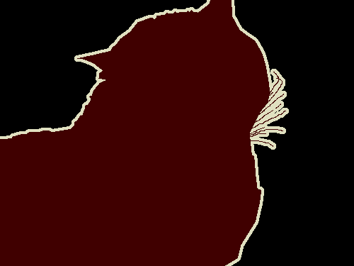
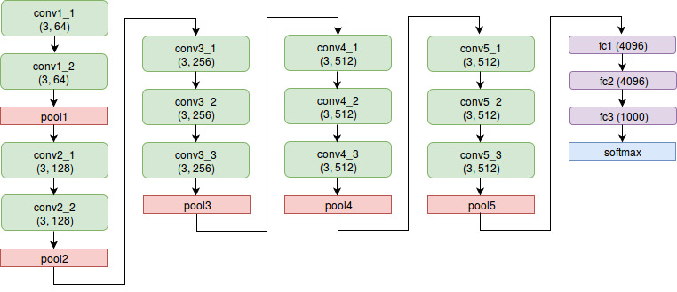
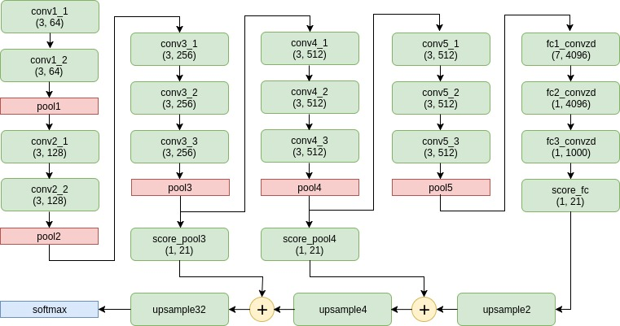
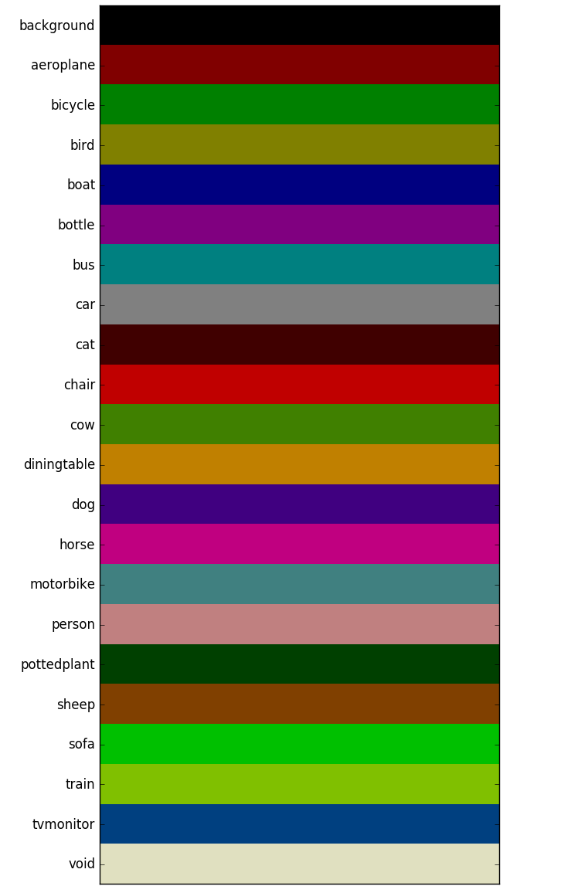

import result1 from '../assets/fcn/results/1.png';
import result1gt from '../assets/fcn/results/1gt.png';
import result1p from '../assets/fcn/results/1p.png';

import result2 from '../assets/fcn/results/2.png';
import result2gt from '../assets/fcn/results/2gt.png';
import result2p from '../assets/fcn/results/2p.png';

import result3 from '../assets/fcn/results/3.png';
import result3gt from '../assets/fcn/results/3gt.png';
import result3p from '../assets/fcn/results/3p.png';

import result4 from '../assets/fcn/results/4.png';
import result4gt from '../assets/fcn/results/4gt.png';
import result4p from '../assets/fcn/results/4p.png';

import result5 from '../assets/fcn/results/5.png';
import result5gt from '../assets/fcn/results/5gt.png';
import result5p from '../assets/fcn/results/5p.png';

import result6 from '../assets/fcn/results/6.png';
import result6gt from '../assets/fcn/results/6gt.png';
import result6p from '../assets/fcn/results/6p.png';

import result7 from '../assets/fcn/results/7.png';
import result7gt from '../assets/fcn/results/7gt.png';
import result7p from '../assets/fcn/results/7p.png';

import result8 from '../assets/fcn/results/8.png';
import result8gt from '../assets/fcn/results/8gt.png';
import result8p from '../assets/fcn/results/8p.png';

import result9 from '../assets/fcn/results/9.png';
import result9gt from '../assets/fcn/results/9gt.png';
import result9p from '../assets/fcn/results/9p.png';

import result10 from '../assets/fcn/results/10.png';
import result10gt from '../assets/fcn/results/10gt.png';
import result10p from '../assets/fcn/results/10p.png';

import Grid from "@material-ui/core/Grid";

<link
  rel="stylesheet"
  href="https://cdn.jsdelivr.net/npm/katex@0.11.0/dist/katex.min.css"
  integrity="sha384-BdGj8xC2eZkQaxoQ8nSLefg4AV4/AwB3Fj+8SUSo7pnKP6Eoy18liIKTPn9oBYNG"
  crossOrigin="anonymous"
/>

<p style="text-align: justify">
  <b>TL,DR: This blog post presents my implementation of the <a href="https://people.eecs.berkeley.edu/~jonlong/long_shelhamer_fcn.pdf" target="_blank">FCN paper</a>. Code for this can be found on <a href="http://github.com/plantsandbuildings/FCN" target="_blank">my Github</a>.</b>
</p>

<hr/>

<p style="text-align: justify">
  <b>Disclaimer: What follows is not a tutorial, they're my implementation notes. If you're looking for material on what FCNs are and such - then you probably don't stand to gain much from reading on. For that, I suggest going through the paper linked above. What follows is probably most useful to people who are either planning to or are in the midst of implementing an FCN themselves. My aim here is to talk about details that revealed themselves to me only after several torturous hours of scouring the depths of the Internet.</b>
</p>

<hr/>

<h4>
  Structure of this post:
</h4>

<ul>
  <li><a href="#section1">What is Semantic Segmentation?</a></li>
  <li><a href="#section2">How do we do it?</a></li>
  <li><a href="#section3">The Pretrained VGG-Net</a></li>
  <li><a href="#section4">Convolutionalize Dense Layers</a></li>
  <li><a href="#section5">Score Layers and Color Maps</a></li>
  <li><a href="#section6">Upsampling Layers</a></li>
  <li><a href="#section7">Cropping and Skip Connections</a></li>
  <li><a href="#section8">Results</a></li>
</ul>

<p style="text-align: justify">
  Not sure if reading this *really* long post is worth your time? Maybe jump to the <a href="#section8">results</a> section first, and then come back to the rest of it.
</p>

<hr/>

<h4 id="section1">What is Semantic Segmentation?</h4>
<p style="text-align: justify">
  <b>Semantic Segmentation</b> is the task of labeling each pixel of an input image with class labels from a predetermined set of classes. For example, given the following image:
</p>


<p style="text-align: justify">
  the segmentation result should look like:
</p>



<p style="text-align: justify">
  See how all the pixels in the input image that belong to the cat are color coded brown and the background is color coded black? That is the end result we hope to achieve.
</p>

<hr/>

<h4 id="section2">How do we do it?</h4>

<p style="text-align: justify">
  In this blog post, we will see how Fully Convolutional Networks (FCNs) can be used to perform semantic segmentation. A blazing fast walkthrough of the FCN paper by Long, Shelhamer and Darrell: we take a VGG-Net trained for image classification on the ILSVRC dataset and "convolutionalize" it (more on this "convolutionalization" in the following sections). We then append a score layer and upsampling layers to the end of the pretrained, convolutionalized VGG-Net and then use per-pixel softmax to obtain dense predictions. Skip connections from the VGG pooling layers to the upsampling layers are also added. We do all of this using Tensorflow.
</p>

<p style="text-align: justify">
  I'll analyze each aspect of this walkthrough in greater detail, but first a small note on the dataset I've used. PASCAL-VOC 2012 is a very standard dataset used for training segmentation models. It contains $ \sim 1000 $ images of varying dimensions each in the training and testing sets. More information about the dataset can be found <a href="http://host.robots.ox.ac.uk/pascal/VOC/" target="_blank">here</a>.
</p>

<hr/>

<h4 id="section3">The Pretrained VGG-Net</h4>

<!-- Briefly introduce VGG Architecture -->
<p style="text-align: justify">
  <a href="https://arxiv.org/pdf/1409.1556.pdf" target="_blank">VGG-Net</a> is a CNN architecture originally presented by Simonyan and Zisserman for the ImageNet Classification Task 2014. AFAIK, it did not win first place that year but still went on to become a VERY popular model because of its simplicity. All five variants of VGG-Net presented in the original paper consist only of convolutional and dense layers. The FCN that I've implemented (and the one that is presented in the FCN paper) uses a pretrained VGG-16 for its initial layers. Before I proceed further, it would help to familiarize oneself with the VGG-16 architecture:
</p>

<!-- Image of VGG architecture -->


<!-- Briefly introduce VGG Architecture -->
<p style="text-align: justify">
  About the notation in the above diagram: each convolution layer is specified by an ordered pair (filter size, number of output channels). Each fully connected layer is specified by a single number (number of output units). It can be seen from the diagram that the above VGG-Net has 16 "trainable" layers (that is, 16 layers with weights) - hence the name VGG-16. If you're referring the original VGG paper, you'll find that the above architecture is referred to as the D variant. <b>For our FCN implementation, we use all the convolution and pooling layers from the above architecture as is (ie. all layers from </b><code>conv1_1</code><b> to </b><code>pool5</code><b>, both inclusive, are used as they are presented above in the FCN implementation).</b> The fully connected layers are converted to convolutional layers (see next section on convolutionalization) and then used.
</p>

<!-- How to obtain the model weights. Talk about caffe-tensorflow -->
<p style="text-align: justify">
  Coming to the more practical aspect of obtaining and using the trained VGG weights. Luckily for us, the authors of VGG-Net have kindly made their trained models publicly availble on their <a href="http://www.robots.ox.ac.uk/~vgg/research/very_deep/" target="_blank">group's webpage</a>. They've written and trained their model in Caffe; which poses a minor hurdle for those of us using Tensorflow. I say minor because we only need to go an extra step of using <a href="https://github.com/ethereon/caffe-tensorflow" target="_blank">caffe-tensorflow</a> to convert the caffe weights into numpy binary format.
</p>

<!-- Talk about how training the VGG Net from scratch is not feasible for mere mortals -->
<p style="text-align: justify">
  I should note, at this point, that <b>one might be tempted to not use the pretrained weights at all</b>. I initially had the misconception that initializing with the VGG weights is not very important - that the network would learn the weights when I train it end-to-end. This, unfortunately, is not the case. <b>Training the VGG-Net is not a single step process - it is trained in stages, and with increasingly difficult images. The pretrained VGG that we will take for granted in the remainder of this post is no small feat to achieve. It is critical that we have it in our FCN</b>. I cannot harp on this enough: training a VGG from scratch is a sizeable task - one that took the authors weeks of training to complete - it is not to be underestimated.
</p>

<hr/>

<h4 id="section4">Convolutionalize Dense Layers</h4>

<!-- Why is it needed? What purpose does it solve? -->
Here's the deal with this. **Dense layers face the limitation that their input must always have a fixed size. Images, as they go, can be of any size. That is, we may have images of different sizes within a training batch. Likewise, it is not necessary that the image we perform inference on should have dimensions same as any of the training images. Note that this issue of dense layers requiring fixed input size doesn't present with convolutional layers**. The input to a convolutional layer can be of any size and the weights of the layer would still work and still give outputs. The VGG-16 architecture presented above has three fully connected (dense) layers at the very end (`fc1`, `fc2` and `fc3`) and we must take care of them if we are to build an FCN. As the name goes, "Fully Convolutional Networks" should only have convolutional layers. Hence, to accomodate the name, **we must convert the dense VGG layers to convolutional layers**. There exists a beautiful way to go about this.

<!-- How to convert dense layers to conv layers -->
Suppose we have a dense layer that requires $ HW $ input units and produces $ D $ outputs. Ie. the weight matrix has dimensions $ D \times HW $. **This dense layer can be convolutionalized as follows: each row of the dense layer weight matrix can be reshaped into a filter of dimenstions $ H \times W $. Thus we end up with $ D $ filters of size $ H \times W $**. Note that this convolutionalized layer can now take arbitrarily sized inputs (it is exactly the same as any other convolution layer). Also note that if the input to this layer is of size $ H \times W $, then it performs the exact same operation as the original dense layer. I find this quite intuitive and easy to understand, but perhaps a better explanation of this convolutionalization procedure is available in the notes of CS231n <a href="http://cs231n.github.io/convolutional-networks/#convert" target="_blank">here</a>. In code, this reshaping of fully-connected weights of VGG-16 looks something like this:


``` python
fc1_convolutionalized_filters = numpy.reshape(vgg_params['fc1']['weights'], [7, 7, 512, 4096])
```

How did I get the above line of code? Note that the original VGG-16 was trained for the ImageNet classification dataset - where each RGB image was of dimesions $ 224 \times 224 $. So, the input to `fc1` in the original VGG-16 would have been $ 7 \times 7 $. This is easy to work out from the following facts: **the spatial resolution remains unchanged at convolutional layers on account of SAME padding, and the the spatial resolution reduces by factor of $ 2 $ at each pooling layer**. It would be useful to remember these observations as they will be useful later in the post as well. There are five pooling layers between `conv1_1` and `fc1` and hence, the input to `fc1` would have the dimensions $ 224/2^5 \times 224/2^5 $ or $ 7 \times 7 $. Also since the last conv layer before `fc1` (ie. `conv5_3`) has $ 512 $ output channels, the input volume of `fc1` would also have $ 512 $ channels. All in all, in the original VGG architecture, `fc1` sees an input of dimensions $ 7 \times 7 \times 512 $ and gives $ 4096 $ outputs. That is, the weight matrix of layer `fc1` has $ 4096 $ rows and $ 25088 $ columns. Following the convolutionalization logic presented in the last paragraph, each row (of $ 25088 $ weights) can be reshaped into a filter of size $ 7 \times 7 \times 512 $ and we would hence end up with $ 4096 $ such filters. In Tensorflow, we are required to specify convolution layer weights in the format `[filter_height, filter_width, filter_depth, output_channels]`. Hence we simply reshape the VGG weights into the shape [$ 7 $, $ 7 $, $ 512 $, $ 4096 $]. Note that the bias terms can be used as they are:

``` python
fc1_convolutionalized_biases = vgg_params['fc1']['biases']
```

<p style="text-align: justify">
  Finally, we can use these numpy arrays to create the convolutionalized <code>fc1</code> Tensorflow graph node as follows:
</p>

``` python
fc1 = \
  tf.nn.relu(
    tf.nn.bias_add(
      tf.nn.conv2d(
        pool5,
        fc1_convolutionalized_filters,
        [1, 1, 1, 1],
        'SAME'),
      fc1_convolutionalized_biases
    )
  )
```

<p style="text-align: justify">
  Similarly for <code>fc2</code> and <code>fc3</code>,
</p>

``` python
fc2_convolutionalized_filters = numpy.reshape(vgg_params['fc2']['weights'], [1, 1, 4096, 4096])
fc2_convolutionalized_biases  = vgg_params['fc2']['biases']
fc2 = \
  tf.nn.relu(
    tf.nn.bias_add(
      tf.nn.conv2d(
        fc1,
        fc2_convolutionalized_filters,
        [1, 1, 1, 1],
        'SAME'),
      fc2_convolutionalized_biases
    )
  )
```

``` python
fc3_convolutionalized_filters = numpy.reshape(vgg_params['fc3']['weights'], [1, 1, 4096, 4096])
fc3_convolutionalized_biases  = vgg_params['fc3']['biases']
fc3 = \
  tf.nn.relu(
    tf.nn.bias_add(
      tf.nn.conv2d(
        fc2,
        fc3_convolutionalized_filters,
        [1, 1, 1, 1],
        'SAME'),
      fc3_convolutionalized_biases
    )
  )
```

<hr/>

<h4 id="section5">Score Layers and Color Maps</h4>

<!-- Explain what score layers are and why they're needed -->
<p style="text-align: justify">
  For the first time ever in this post, we present the complete FCN architecture:
</p>

<!-- FCN architecture image -->


First off, note how the fully connected layers from the VGG architecture have now become convolution layers. Also now we see the addition of <b>three new kinds of layers: score layers, upsample layers and addition layers</b>. In this section we will tackle score layers.

**Score layers are nothing but convolutional layers having kernel dimensions $ 1 \times 1 $ and $ 21 $ output channels**. My (intuitive) understanding of the nomenclature is as follows:

Suppose the input volume to a score layer has dimensions $ H \times W \times F $. This is thought of as an image of dimensions $ H \times W $ and each pixel of the image is made up of $ F $ features. The score layer goes over each pixel, and at each pixel location predicts (on the basis of the $ F $ features at that pixel location) scores for each possible output class. In our case, there are a total of $ 21 $ output classes - $ 20 $ object classes and background. Hence, the score layer in our case goes over each pixel location and predicts (at each pixel location) $ 21 $ scores - each score representing the likeliness of an output class.

<!-- Explain color maps -->

Note that the output of our score layers will have dimesions $ H \times W \times 21 $. At each pixel location, we can obtain a class prediction by simply picking the argmax of all $ 21 $ scores at that location. However, this doesn't lead us to a very visually appealing representation of the segmentation. **We would like to associate each each output class with a color, so that we can map our $ H \times W $ class predictions to an $ H \times W $ image (like the segmented cat image presented at the very beginning of this post)**. Ie. we need a color map.

<!-- Present MATLAB code for obtaining colors -->
<p style="text-align: justify">
  The MATLAB modules provided along with the PASCAL-VOC dataset have the following code:
</p>

``` matlab
% VOCLABELCOLORMAP Creates a label color map such that adjacent indices have different
% colors.  Useful for reading and writing index images which contain large indices,
% by encoding them as RGB images.
%
% CMAP = VOCLABELCOLORMAP(N) creates a label color map with N entries.
function cmap = VOClabelcolormap(N)

if nargin==0
    N=256;
end
cmap = zeros(N,3);
for i=1:N
    id = i-1; r=0;g=0;b=0;
    for j=0:7
        r = bitor(r, bitshift(bitget(id,1),7 - j));
        g = bitor(g, bitshift(bitget(id,2),7 - j));
        b = bitor(b, bitshift(bitget(id,3),7 - j));
        id = bitshift(id,-3);
    end
    cmap(i,1)=r; cmap(i,2)=g; cmap(i,3)=b;
end
cmap = cmap / 255;
```

<p style="text-align: justify">
  For the MATLAB averse, <a target="_blank" href="https://github.com/wllhf">wllhf</a> has kindly provided <a target="_blank" href="https://gist.github.com/wllhf/a4533e0adebe57e3ed06d4b50c8419ae">this gist</a> which contains a Python script that does the exact same thing as the above MATLAB code. That is, the script provides a mapping between output classes and colors:
</p>

<!-- Image of the VOC color map -->


<hr/>

<h4 id="section6">Upsampling Layers</h4>

The second new kind of layer we see in the FCN architecture are **upsampling layers**. Specifically, there are three of these: `upsample2` `upsample4` and `upsample32`. As one might expect from the name, upsampling layers increase the dimensions of the input that is provided to them by some factor. The way I've named each of my upsampling layers is: `upsampleXYZ`, where `XYZ` is the factor of upsampling wrt **the lowest dimesions that the input to the network is pooled to (Ie. the output of **`pool5`**).** So, if the output of `pool5` has spatial dimensions $ H \times W $, then the output of `upsample2` has dimensions $ 2H \times 2W $; the output of `upsample4` has dimesions $ 4H \times 4W $ and the output of `upsample32` has dimensions $ 32H \times 32W $.

The upsampling layers are just convolutional layers of a special kind. If you don't understand how I can state that so directly, please refer <a href="https://arxiv.org/abs/1603.07285">chapter 4 of this document</a> on convolution arithmetic. The FCN paper tells us to initialize the filters of the upsample layer with bilinear interpolation filters. It will take me a complete post to explain resampling and bilinear interpolation - I would refer the reader to <a href="http://warmspringwinds.github.io/tensorflow/tf-slim/2016/11/22/upsampling-and-image-segmentation-with-tensorflow-and-tf-slim/" target="_blank">this post on Daniil Pakhomov's blog</a>. I strongly encourage reading the post atleast three times word for word - it contains extremely valuable theory and practical information about resampling, specifically bilinear interpolation. I have adapted the code presented in Daniil's blog post to generate the filters and create my upsampling layers:

<p>Method to generate the upsampling filters:</p>

``` python
def _get_upconv_params(factor, out_channels, name):
  kernel_sz = 2*factor - factor%2
  weights = np.zeros([kernel_sz, kernel_sz, out_channels, out_channels], dtype=np.float32)

  # Populate weights
  if kernel_sz % 2 == 1:
    center = factor - 1
  else:
    center = factor - 0.5
  tmp = np.ogrid[:kernel_sz, :kernel_sz]
  kernel = (1 - abs(tmp[0] - center)/factor) * (1 - abs(tmp[1] - center)/factor)
  for i in range(out_channels):
    weights[:, :, i, i] = kernel

  # Populate biases
  biases = np.zeros([out_channels,], dtype=np.float32)

  dic = {
    'weights': tf.Variable(weights, '{}_weights'.format(name)),
    'biases': tf.Variable(biases, '{}_biases'.format(name))
  }
  return dic
```

<p><code>upsample2</code> node in the Tensorflow computation graph:</p>

``` python
params['upsample2'] = _get_upconv_params(2, 21, 'upsample2')
net['upsample2'] = tf.nn.conv2d_transpose(
    net['score_fc'],
    params['upsample2']['weights'],
    output_shape = [1, tf.shape(net['score_fc'])[1] * 2, tf.shape(net['score_fc'])[2] * 2, 21],
    strides = [1,2,2,1]
  )
```

<hr/>

<h4 id="section7">Cropping and Skip Connections</h4>

Finally, the last "new" kind of layer in the FCN architecture is the **addition layer (also called a fuse layer or skip connection)**. This layer takes in two input volumes and adds them elementwise. Note that **an important prerequisite of this addition is that the dimensions of the two input volumes must exactly match**. Now, since the pool layers follow the 'SAME' scheme of max-pooling they reduce an input of dimensions $ H \times W $ to an output of dimensions $ \lfloor (H+1)/2 \rfloor \times \lfloor (W+1)/2 \rfloor $. However, the upsample layer increases the dimensions of an input ($ H \times W $) to $ 2H \times 2W $ (when the upsampling factor is 2). It is not too hard to show from these two observations that the output of `upsample2` always has dimensions greater than or equal to the output of `pool4` (equivalently, the output of `score_pool4`). Empirically, suppose that the output  of `pool4` (input to `pool5`) has size $ 5 \times 5 $; then the output of `pool5` will be of size $ 3 \times 3 $. The upsampling (`upsample2`) would hence produce an output of $ 6 \times 6 $ (greater dimensions than the output of `pool4`). **Thus, in order for us to create a fuse layer with `score_pool4` and `upsample2` as inputs, we must first crop `upsample2` to an appropriate size**. I have implemented this cropping as follows:

``` python
def _get_crop_layer(big_batch, small_batch):
  h_s = tf.shape(small_batch)[1]
  w_s = tf.shape(small_batch)[2]

  h_b = tf.shape(big_batch)[1]
  w_b = tf.shape(big_batch)[2]

  return big_batch[:,
                 (h_b - h_s)//2 : (h_b - h_s)//2 + h_s,
                 (w_b - w_s)//2 : (w_b - w_s)//2 + w_s,
                 :]
```

<p style="text-align: justify">
  Now, the fuse layer can be implemented as follows:
</p>

``` python
# Crop upsample2
net['cropped_upsample2'] = _get_crop_layer(net['upsample2'], net['pool4'])

# Score pool4
params['score_pool4'] = _get_score_layer_init_params('score_pool4')
net['score_pool4'] = _get_conv_layer(net['pool4'], params['score_pool4'])

# Fuse pool4
net['fuse_pool4'] = tf.add(net['score_pool4'], net['cropped_upsample2'])
```

<p style="text-align: justify">
  A few minor notes about the above code. The method to initialize score layer parameters (<code>_get_score_layer_init_params</code>) initializes filter weights using the <b>Xavier initialization scheme</b> and the biases to zero. Also it should be noted that for the crop layer implementation to work, the batch size <b>must be fixed to one</b>. Finally, here I've only presented cropping of the <code>upsample2</code> output. <b>The outputs of </b><code>upsample4</code> <b>and</b> <code>upsample32</code> <b>must also be cropped to the sizes of</b> <code>pool3</code> <b>and the input image respectively</b>.
</p>

<hr/>

<h4 id="section8">Results</h4>

<p style="text-align: justify">
  The standard metric for evaluating segmentation performance is mean intersection over union. Ie. mean ratio of the number of correctly predicted pixels to  the total number of pixels (mean is computed over all the images in the test set). I haven't gone to the extent of computing this metric for my model - mainly because my aim, going into the project, was more to get a program to do something cool and something which produces visually gratifying results than to produce a model that achieves state of the art results. I suppose though (and this guess may be well off the mark), that with a fair amount of fine tuning, it is possible to reproduce (atleast to a very small margin of error) the results reported in the original paper. Besides, I feel like the implementation process has already shown me the large bulk of what the FCN paper had to offer - and sitting around now, hoping and praying to God that a particular hyperparameter setting pushes the mIOU metric up by a third decimal point is not (IMHO) the best use of my time.
</p>

<p> *mic drop* </p>


Now for the moment we've all been holding our breaths for! Without further ado, here they are. Leftmost panel contains the original image, middle panel contains the ground truth segmentation and the rightmost panel contains the predicted segmentation.


<Grid container>
    <Grid item xs = {12} md={4}>
        
    </Grid>
    <Grid item xs = {12} md={4}>
        
    </Grid>
    <Grid item xs = {12} md={4}>
        
    </Grid>
    <Grid item xs = {12} md={4}>
        
    </Grid>
    <Grid item xs = {12} md={4}>
        
    </Grid>
    <Grid item xs = {12} md={4}>
        
    </Grid>
    <Grid item xs = {12} md={4}>
        
    </Grid>
    <Grid item xs = {12} md={4}>
        
    </Grid>
    <Grid item xs = {12} md={4}>
        
    </Grid>
    <Grid item xs = {12} md={4}>
        
    </Grid>
    <Grid item xs = {12} md={4}>
        
    </Grid>
    <Grid item xs = {12} md={4}>
        
    </Grid>
    <Grid item xs = {12} md={4}>
        
    </Grid>
    <Grid item xs = {12} md={4}>
        
    </Grid>
    <Grid item xs = {12} md={4}>
        
    </Grid>
    <Grid item xs = {12} md={4}>
        
    </Grid>
    <Grid item xs = {12} md={4}>
        
    </Grid>
    <Grid item xs = {12} md={4}>
        
    </Grid>
    <Grid item xs = {12} md={4}>
        
    </Grid>
    <Grid item xs = {12} md={4}>
        
    </Grid>
    <Grid item xs = {12} md={4}>
        
    </Grid>
    <Grid item xs = {12} md={4}>
        
    </Grid>
    <Grid item xs = {12} md={4}>
        
    </Grid>
    <Grid item xs = {12} md={4}>
        
    </Grid>
    <Grid item xs = {12} md={4}>
        
    </Grid>
    <Grid item xs = {12} md={4}>
        
    </Grid>
    <Grid item xs = {12} md={4}>
        
    </Grid>
    <Grid item xs = {12} md={4}>
        
    </Grid>
    <Grid item xs = {12} md={4}>
        
    </Grid>
    <Grid item xs = {12} md={4}>
        
    </Grid>
</Grid>